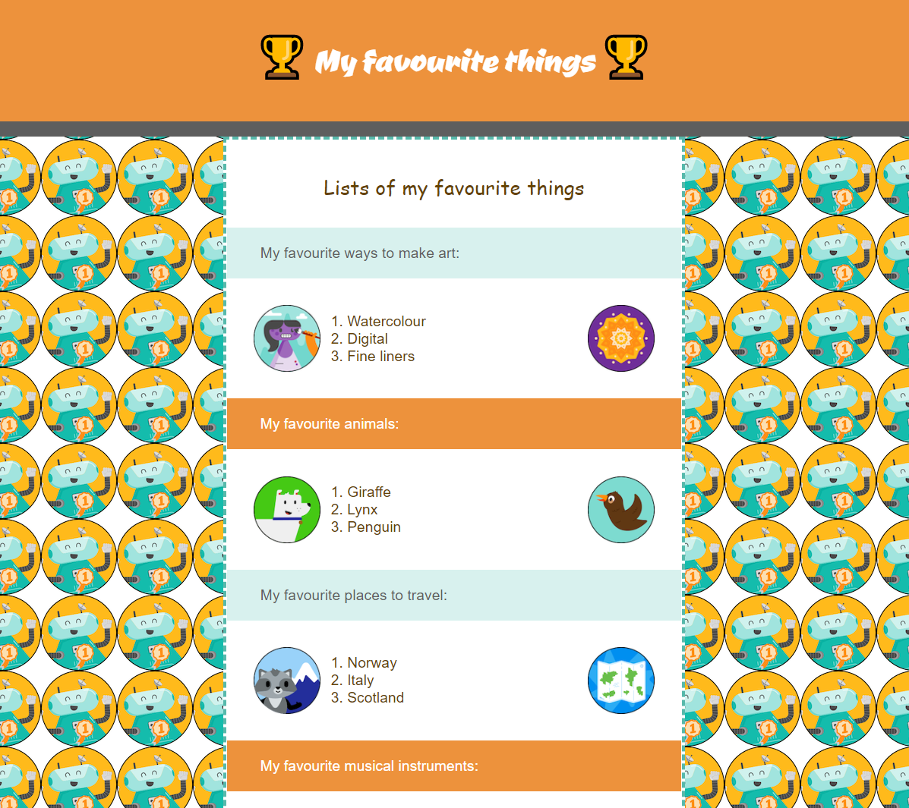

## What next?

If you are following the [Intro to web](https://projects.raspberrypi.org/en/raspberrypi/web-intro) path, you should move on to the [Build a webpage](https://projects.raspberrypi.org/en/projects/build-a-webpage) project. In this project, you will make a webpage to promote a product or idea.

--- print-only ---

--- /print-only ---

--- no-print ---

**Favourite things**:

<iframe src="https://trinket.io/embed/html/6517c8056d?outputOnly=true" width="600" height="500" frameborder="0" marginwidth="0" marginheight="0" allowfullscreen></iframe>

--- /no-print ---
