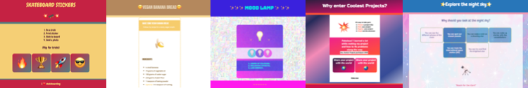
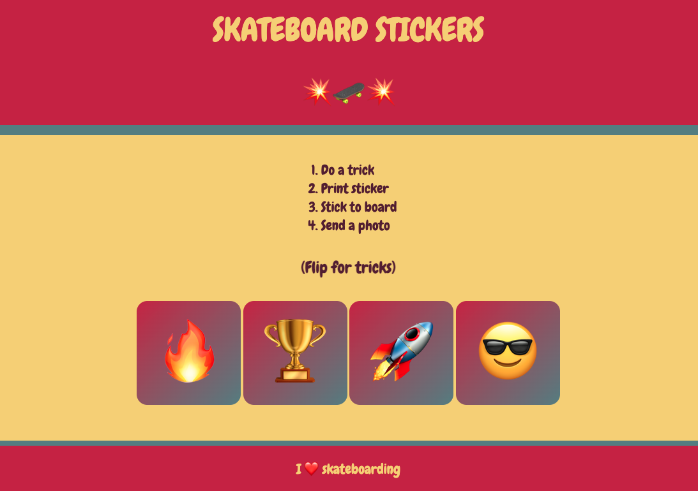
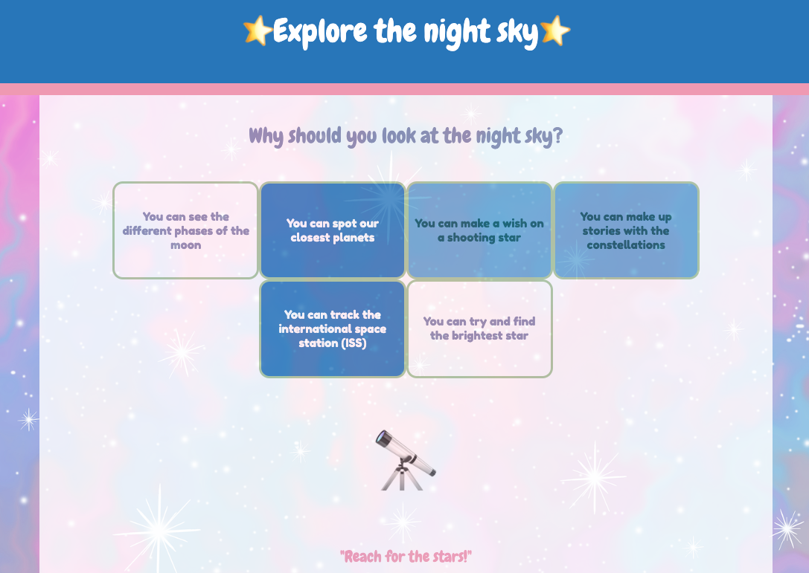

## Introduction

In this project, you will make a web page to sell a product or idea based around your choice of emoji. This kind of web page is called a **landing page**.

A **landing page** is a single web page designed to convince people about a product or idea. The purpose of a landing page is to get someone to take action. This could be buying something, recycling more, participating in an event or sharing the web page with others. 

You will:
+ Show rather than tell, use short sentences and a simple layout
+ Engage your audience with interaction or animation
+ Style your page to make it stand out

--- no-print ---

--- task --- 

### Try it

  
Skateboarding is a fun sport to try out and has different skills for people to learn. What effects have been used to make this webpage stand out and get people excited about the sport?

**Skateboarding**: [See inside](https://trinket.io/html/87d81b7512){:target="_blank"}

<iframe src="https://trinket.io/embed/html/87d81b7512?outputOnly=true" width="600" height="500" frameborder="0" marginwidth="0" marginheight="0" allowfullscreen></iframe>

--- /task ---

### Get inspiration 

You are going to make some design decisions to create your landing page.

--- task ---

Explore these example projects to get more ideas:

**Banana bread**: [See inside](https://trinket.io/html/a4e230c535){:target="_blank"}

<iframe src="https://trinket.io/embed/html/a4e230c535?outputOnly=true" width="600" height="500" frameborder="0" marginwidth="0" marginheight="0" allowfullscreen></iframe>

**Mood lamp**: [See inside](https://trinket.io/html/62601dda11){:target="_blank"}

<iframe src="https://trinket.io/embed/html/62601dda11?outputOnly=true" width="600" height="500" frameborder="0" marginwidth="0" marginheight="0" allowfullscreen></iframe>

**Night sky**: [See inside](https://trinket.io/html/6344610ccb){:target="_blank"}

<iframe src="https://trinket.io/embed/html/6344610ccb?outputOnly=true" width="600" height="500" frameborder="0" marginwidth="0" marginheight="0" allowfullscreen></iframe>

**Coolest projects**: [See inside](https://trinket.io/html/d5472c9b55){:target="_blank"}

<iframe src="https://trinket.io/embed/html/d5472c9b55?outputOnly=true" width="600" height="500" frameborder="0" marginwidth="0" marginheight="0" allowfullscreen></iframe>

--- /task ---
--- /no-print ---

--- print-only ---

### Get inspiration 

**Skateboarding**

**Banana bread**

**Mood lamp**

**Night sky**

**Coolest Projects**

--- /print-only ---

