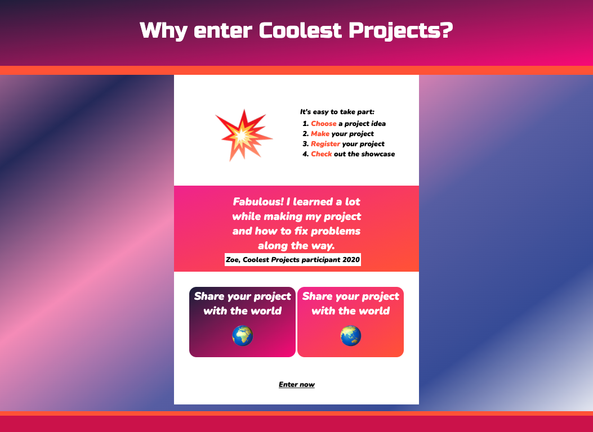

## Introduction

In this project, you will make a webpage to sell a product or idea based around your choice of emojis. This kind of webpage is called a **landing page**.

A **landing page** is a single webpage designed to convince people about a product or idea. The purpose of a landing page is to get someone to take action. This could be to buy something, recycle more, participate in an event, or share the webpage with others. 

You will:
+ Use short sentences and a simple layout to show visitors your product or idea
+ Engage your visitors with interaction or animation
+ Style your page to make it attract visitors' attention

A person who views a webpage or website is often called a **visitor**. 

--- no-print ---

--- task --- 

### Try it

  
Skateboarding is a fun sport to try out and has different skills for people to learn. What effects have been used to make this webpage get people excited about the sport?

**Skateboarding**: [See inside](https://staging-editor.raspberrypi.org/en/projects/skateboarding){:target="_blank"}

<iframe src="https://staging-editor.raspberrypi.org/en/embed/viewer/skateboarding" width="600" height="500" frameborder="0" marginwidth="0" marginheight="0" allowfullscreen> </iframe>

--- /task ---

### Get inspiration 

You will make some design decisions to create your landing page.

--- task ---

Explore these example projects to get more ideas.

**Banana bread**: [See inside](https://staging-editor.raspberrypi.org/en/projects/vegan-banana-bread){:target="_blank"}

<iframe src="https://staging-editor.raspberrypi.org/en/embed/viewer/vegan-banana-bread" width="600" height="500" frameborder="0" marginwidth="0" marginheight="0" allowfullscreen> </iframe>

**Mood lamp**: [See inside](https://staging-editor.raspberrypi.org/en/projects/mood-lamp){:target="_blank"}

<iframe src="https://staging-editor.raspberrypi.org/en/embed/viewer/mood-lamp" width="600" height="500" frameborder="0" marginwidth="0" marginheight="0" allowfullscreen> </iframe>

    

**Night sky**: [See inside](https://staging-editor.raspberrypi.org/en/projects/night-sky){:target="_blank"}

<iframe src="https://staging-editor.raspberrypi.org/en/embed/viewer/night-sky" width="600" height="500" frameborder="0" marginwidth="0" marginheight="0" allowfullscreen> </iframe>

    

**Coolest projects**: [See inside](https://staging-editor.raspberrypi.org/en/projects/coolest-projects){:target="_blank"}

<iframe src="https://staging-editor.raspberrypi.org/en/embed/viewer/coolest-projects" width="600" height="500" frameborder="0" marginwidth="0" marginheight="0" allowfullscreen> </iframe>

--- /task ---

--- /no-print ---

--- print-only ---

### Get inspiration 

**Skateboarding**

**Banana bread**

**Mood lamp**

**Night sky**

**Coolest Projects**

--- /print-only ---

