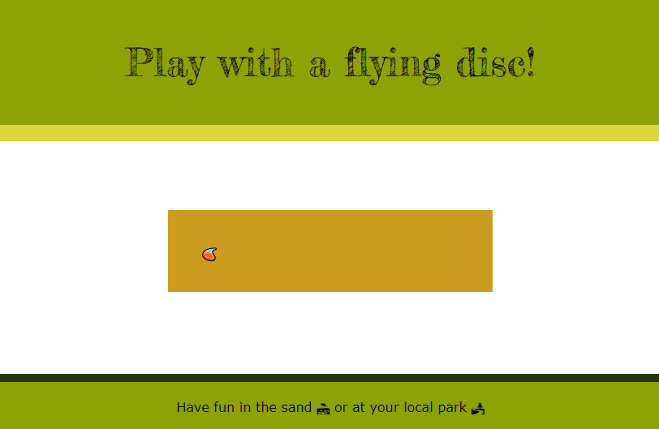
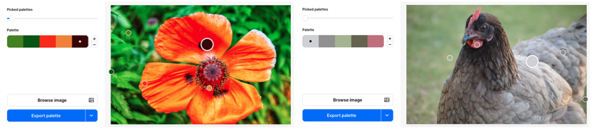

## What are you selling?

In this step, you will choose emojis that represent your product or idea. You will also select a colour palette and font for your landing page. 

{:width="300px"}

--- task ---

Open the [Sell me something starter project](https://staging-editor.raspberrypi.org/en/projects/sell-me-something-starter){:target="_blank"}

--- /task ---

--- task ---

**Choose** one or more emojis to represent a project or idea:
+ 🔬 A product such as a mood lamp or a food item
+ 💝 A cause such as recycling or being kind to people
+ 💃🏿 A hobby such as cycling or dancing
+ 🍰 A great recipe, book, or song
+ 🏞️ An event, an activity, or a place to visit

[[[choose-an-emoji]]]

--- /task ---

--- task ---

**Choose:** Add a `
` that contains your emoji to either the `<header>` or a `<section>` in the `<main>` part of your page. 

--- code ---
---
language: html
filename: index.html
line_numbers: false
---

 
🦋

--- /code ---

**Tip:** You can move your emoji around your page later if you change your mind. 

--- /task ---

A landing page usually has a **call to action** which is something you want visitors to your page to do. You may want visitors to click on a link, try out a hobby or activity, or share the page with others.  

--- task ---

**Decide:** Think about the purpose of your page. What are you trying to convince your audience to do? The webpage's purpose could be to convince visitors to buy something, take up a new hobby, try an activity, or support a cause. 

Remember this purpose while you design your page. Try to make your page as appealing and persuasive as you can.

--- /task ---

--- task ---

**Choose** a colour palette that works well for your product page.

You could use one of the 20 included colour palettes or create your own. 

[[[hex-colour-palettes]]]

[[[web-colour-palette]]]

You could get a colour palette inspiration from an image.

[[[trinket-image-library]]] 

[[[colours-from-image]]]

--- /task ---

--- task ---

**Choose** fonts that fit with your product or idea. 

You can use the font that is included with your chosen colour palette or pick a different one. 

[[[included-fonts]]]

[[[web-fonts]]]

[[[google-fonts]]]

--- /task ---

--- task ---

Change the `<title>` element text to the title of your page.

--- /task ---

--- task ---

Add a `<h1>` heading to the header with the name of your product or idea. To choose a colour scheme class for the `<header>`, add a colour scheme class.

[[[web-primary-secondary]]]

--- /task ---

--- task ---

You could also add a colour scheme class for the `<footer>`.

--- /task ---

--- task ---

**Test:** Check that you are happy with your emoji(s), product title, and style choices. 

--- /task ---

