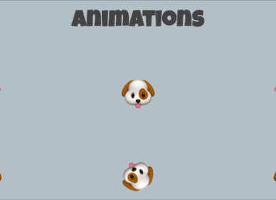

## Use animation

Now it’s time to add some features that will make your product page stand out with interaction or animation.

{:width="300px"}

--- task ---

Add one or more flip cards that visitors can interact with to engage with your web page:

[[[web-flip-cards]]]

--- /task ---

--- task ---

Add animation to some of your content. You could add animation to:
+ Your heading
+ A list
+ An emoji
+ A link
+ Or something else

Remember: Animations will grab attention so add them to the content you want visitors to be drawn to: 

[[[web-starter-animations]]]

You could amend the starter animations to have a bigger impact by changing their timing, repeats or actions:

[web-customise-animations]

--- /task ---

--- task ---

**Test:** Look at your web page. Would it grab a visitor's attention?

--- /task ---

