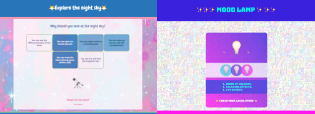
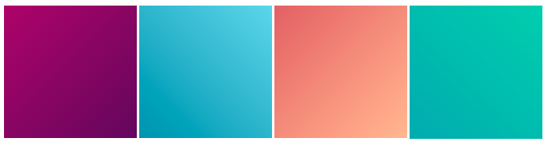
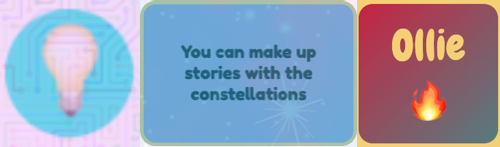
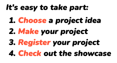

## Add more style

A landing page needs to look really appealing. In this step, you can add additional styling to make your product or idea look really great. 

{:width="300px"}

--- task ---

You could add a **background image** to your webpage. This works well with transparency on your main content. 

[[[trinket-image-library]]] 

[[[web-background-image]]]

[[[add-transparency]]]

--- /task ---

--- task ---

You could add a **gradient** to a `<main>`, a `<section>`, a `
`, or an `` element:

[[[add-a-gradient]]]

**Tip:** Try to change the direction of the gradient to decide what you prefer. 

--- /task ---

**Tip:** Any changes that you make to classes in `style.css` apply everywhere on the webpage that the class is used. You may find that you want to introduce a new CSS class. You might want a third gradient style, different colour combinations, or different borders.

--- task ---

You can create a new class if you want more variety on your webpage.

[[[web-add-class]]]

--- /task ---

--- task ---

You could style elements with borders, shadows, or rounded corners:

[[[web-borders]]]

[[[rounded-corners]]]

[[[web-box-shadow]]]

--- /task ---

--- task ---

You can also change the size of elements using headings or the style of text. 

[[[web-strong-em]]]

[[[web-large-text-tiles]]]

**Tip:** You can change an emoji's size like you would change the size of your text. Use heading tags or `bigfont` and `hugefont` classes. 

[[[huge-emoji]]]

--- /task ---

--- task ---

**Test:** Look at your website. Is there anything else you could do to make people pay attention to your product or idea?

[[[image-not-displayed]]]

[[[font-not-displayed]]]

[[[web-debug-link]]]

--- /task ---
