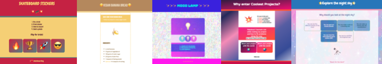
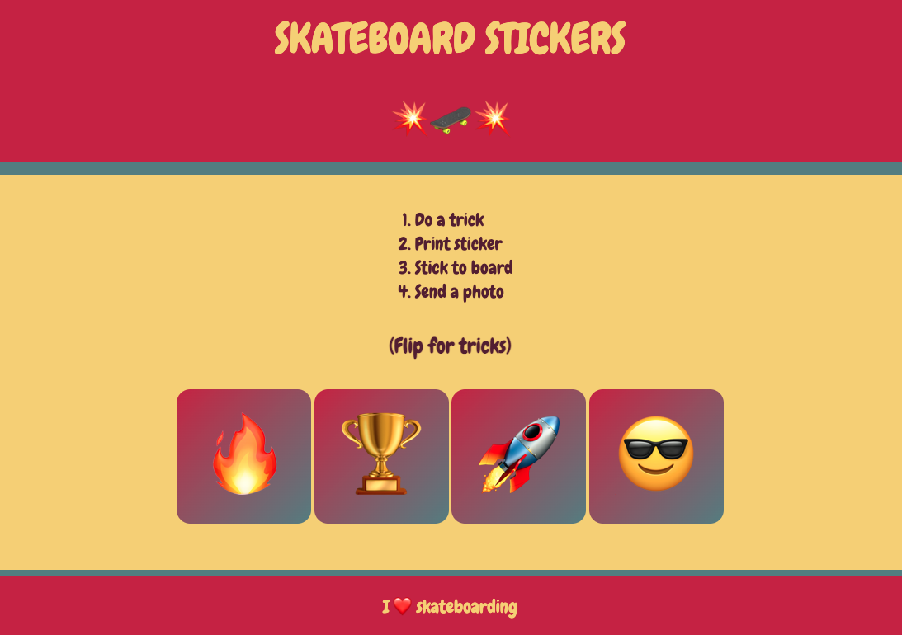
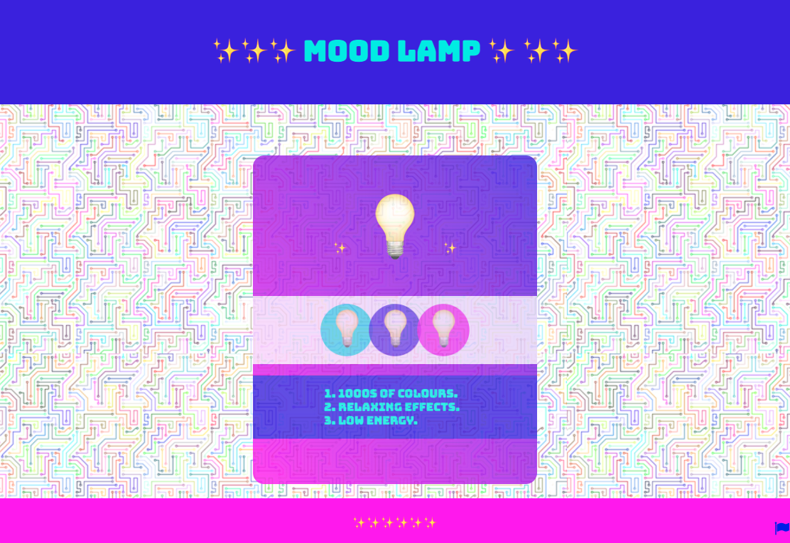
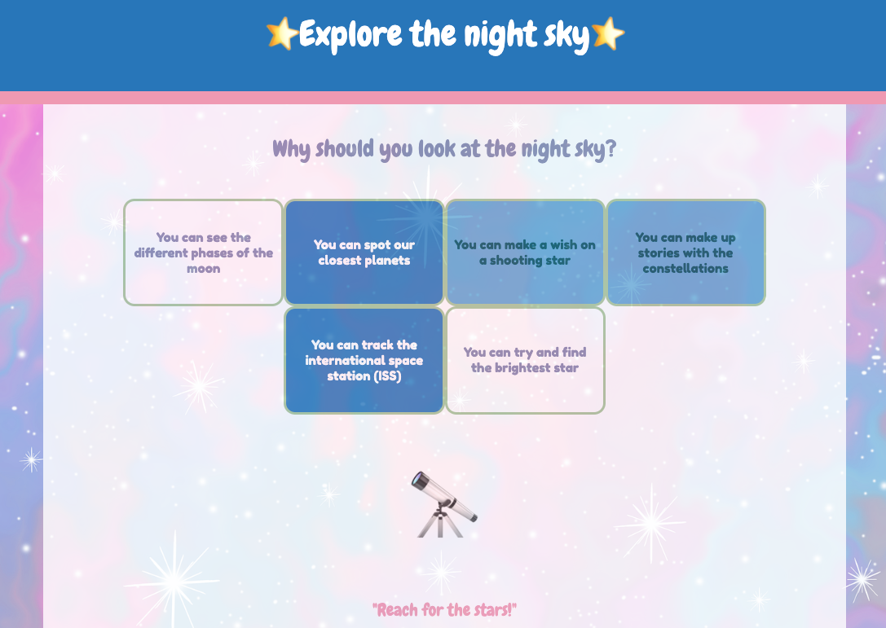
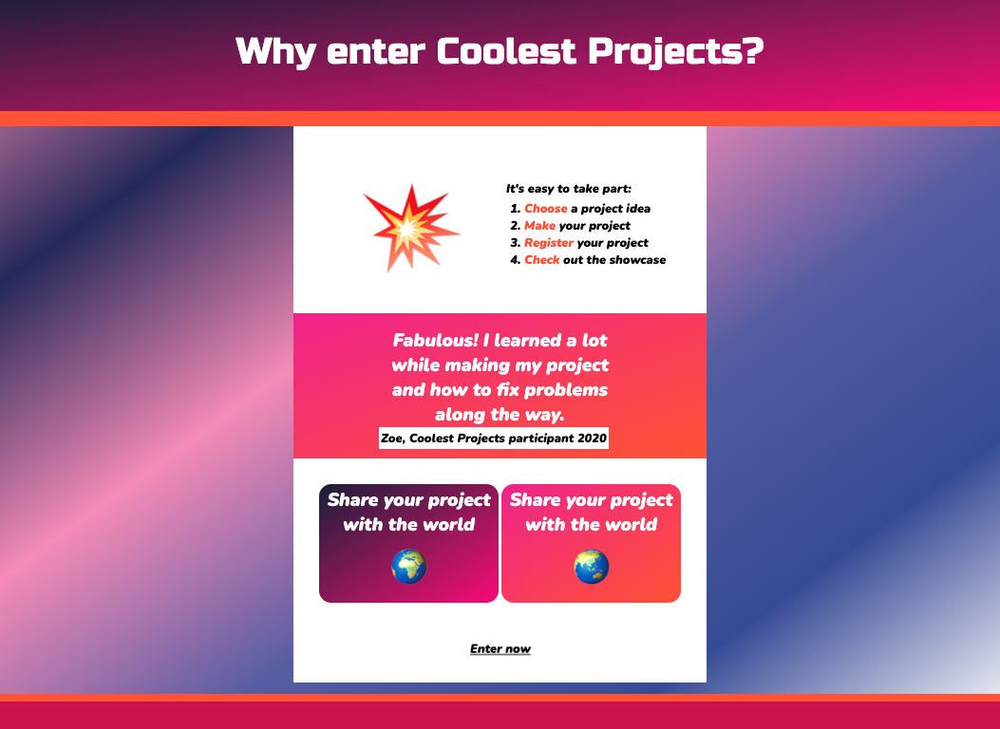

## Introduction

Dans ce projet, tu vas faire une page web pour vendre un produit ou une idée basée sur ton choix d'emojis. Ce type de page web est appelé une **page de destination**.

Une **page de destination** est une seule page web conçue pour convaincre les gens sur un produit ou une idée. Le but d’une page de destination est d’amener quelqu’un à agir. Cela pourrait être d'acheter quelque chose, de recycler plus, de participer à un événement ou de partager la page web avec d'autres personnes. 

Tu vas :

- Utiliser des phrases courtes et une mise en page simple pour montrer aux visiteurs ton produit ou ton idée
- Inciter tes visiteurs à interagir ou à animer
- Styliser ta page pour qu'elle attire l'attention des visiteurs

Une personne qui consulte une page web ou un site web est souvent appelée un **visiteur**. 

--- no-print ---

--- task --- 

### Essaie-le
Le skateboard est un sport amusant à essayer et a différentes compétences à apprendre pour les gens. Quels effets ont été utilisés pour que cette page web suscite l’enthousiasme des gens pour ce sport ?
**Skateboarding** : [voir à l'intérieur](https://editor.raspberrypi.org/fr-FR/projects/skateboarding){:target="_blank"}

<iframe src="https://editor.raspberrypi.org/fr-FR/embed/viewer/skateboarding" width="600" height="500" frameborder="0" marginwidth="0" marginheight="0" allowfullscreen> </iframe>

--- /task ---

### Trouve l'inspiration

Tu prendras certaines décisions de conception pour créer ta page de destination.

--- task ---

Explore ces exemples de projets pour obtenir plus d'idées.

**Pain aux bananes** : [voir à l'intérieur](https://editor.raspberrypi.org/fr-FR/projects/vegan-banana-bread){:target="_blank"}

<iframe src="https://editor.raspberrypi.org/fr-FR/embed/viewer/vegan-banana-bread" width="600" height="500" frameborder="0" marginwidth="0" marginheight="0" allowfullscreen> </iframe>

**Lampe d'ambiance** : [voir à l'intérieur](https://editor.raspberrypi.org/fr-FR/projects/mood-lamp){:target="_blank"}

<iframe src="https://editor.raspberrypi.org/fr-FR/embed/viewer/mood-lamp" width="600" height="500" frameborder="0" marginwidth="0" marginheight="0" allowfullscreen> </iframe>

**Ciel nocturne** : [voir à l'intérieur](https://editor.raspberrypi.org/fr-FR/projects/night-sky){:target="_blank"}

<iframe src="https://editor.raspberrypi.org/fr-FR/embed/viewer/night-sky" width="600" height="500" frameborder="0" marginwidth="0" marginheight="0" allowfullscreen> </iframe>

**Coolest projects** : [voir à l'intérieur](https://editor.raspberrypi.org/fr-FR/projects/coolest-projects){:target="_blank"}

<iframe src="https://editor.raspberrypi.org/fr-FR/embed/viewer/coolest-projects" width="600" height="500" frameborder="0" marginwidth="0" marginheight="0" allowfullscreen> </iframe>

**Cirque** : [voir à l'intérieur](https://editor.raspberrypi.org/fr-FR/projects/sell-me-something-circus-example){:target="_blank"}

<iframe src="https://editor.raspberrypi.org/fr-FR/embed/viewer/sell-me-something-circus-example" width="600" height="500" frameborder="0" marginwidth="0" marginheight="0" allowfullscreen> </iframe>

--- /task ---

--- /no-print ---

--- print-only ---

### Trouve l'inspiration

**Faire du skateboard**

**Pain aux bananes**

**Lampe d'ambiance**

**Ciel nocturne**

**Coolest Projects**

**Cirque**

--- /print-only ---
