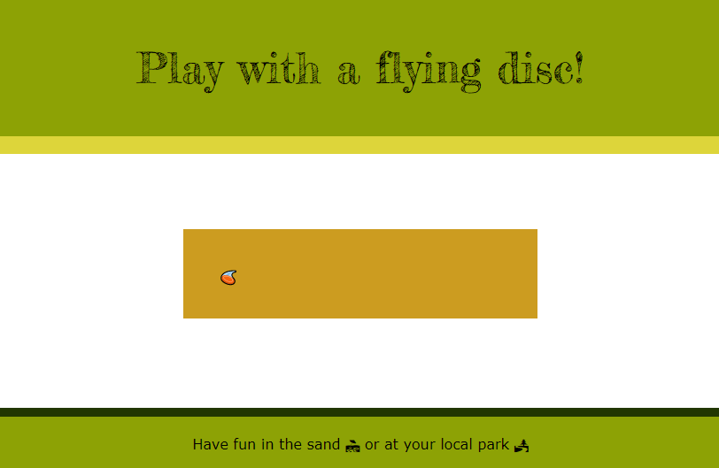

## Qu'est-ce que tu vends ?

Dans cette étape, tu vas choisir des emojis qui représentent ton produit ou ton idée. Tu sélectionneras également une palette de couleurs et une police pour ta page de destination. 

{:width="300px"}

\--- task ---

Ouvre le [projet de démarrage Vends-moi quelque chose](https://editor.raspberrypi.org/fr-FR/projects/sell-me-something-starter){:target="_blank"}

\--- /task ---

\--- task ---

**Choisis** un ou plusieurs emojis pour représenter un projet ou une idée :

- 🧁 Un produit comme un produit alimentaire ou une lampe d'ambiance
- 💝 Une cause comme le recyclage ou la gentillesse des gens
- 💃🏿 Un hobby comme le cyclisme ou la danse
- 🍰 Une recette géniale, un livre ou une chanson
- 🏞️ Un événement, une activité ou un lieu de visite

[[[choose-an-emoji]]]

\--- /task ---

\--- task ---

**Choisis :** ajoute un `
` qui contient ton emoji à la `<header>` ou à un `<section>` dans la partie `<main>` de ta page.

## --- code ---

language: html
filename: index.html
line_numbers: false
--------------------------------------------------------

 
🦋

\--- /code ---

**Astuce :** tu peux déplacer tes emojis sur ta page plus tard si tu changes d'avis.

\--- /task ---

Une page de destination comporte généralement un **appel à l'action**, ce que tu souhaites que les visiteurs de ta page fassent. Tu peux vouloir que les visiteurs cliquent sur un lien, essaient un passe-temps ou une activité, ou partagent la page avec d'autres.  

\--- task ---

**Décide :** pense à l'objectif de ta page. Qu’essaies-tu de convaincre ton public de faire ? Le but de la page web pourrait être de convaincre les visiteurs d'acheter quelque chose, de prendre un nouveau hobby, d'essayer une activité ou de soutenir une cause.

Rappelle-toi cet objectif pendant que tu conçois ta page. Essaie de rendre ta page aussi attrayante et convaincante que possible.

\--- /task ---

\--- task ---

**Choisis** une palette de couleurs qui fonctionne bien pour ta page produit.

Tu peux utiliser une des 20 palettes de couleurs incluses ou créer la tienne.

[[[hex-colour-palettes]]]

[[[web-colour-palette]]]

Tu peux t'inspirer d’une palette de couleurs à partir d’une image.

[[[rpfeditor-image-library]]]

[[[colours-from-image]]]

\--- /task ---

\--- task ---

**Choisis** les polices qui correspondent à ton produit ou idée.

Tu peux utiliser la police qui est incluse dans la palette de couleurs de ton choix ou en choisir une autre.

[[[included-fonts]]]

[[[web-fonts]]]

[[[google-fonts]]]

\--- /task ---

\--- task ---

Remplace le texte de l'élément `<title>` par le titre de ta page.

\--- /task ---

\--- task ---

Ajoute un en-tête '<h1>' à l'en-tête avec le nom de ton produit ou de ton idée. Pour choisir une classe de jeu de couleurs pour le '<header>', ajoute une classe de jeu de couleurs.

[[[web-primary-secondary]]]

\--- /task ---

\--- task ---

Tu peux également ajouter une classe de jeu de couleurs pour le `<footer>`.

\--- /task ---

\--- task ---

**Test:** vérifie que tu es satisfait de ton ou tes emoji, du titre du produit et de tes choix de style.

\--- /task ---
