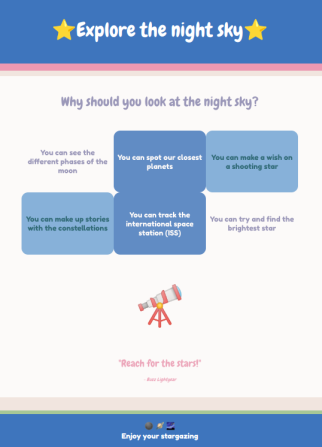

## Ajouter ton contenu

Dans cette étape, tu vas ajouter du contenu qui aide à vendre ton produit ou ton idée. Ceci peut inclure une liste de points clés, des boîtes de fonctionnalités ou des devis clients. 

{:width="300px"}

Le**design** de la page web est un processus pour rendre une page visuellement attrayante, choisir le bon contenu et la conception pour l'accessibilité et l'expérience utilisateur. Une partie du processus de conception de la page web est également de choisir l'élément HTML approprié et de choisir et de créer des styles CSS.  

--- task ---

**Choisis** une mise en page pour ta page web avec `<section>` et des types de contenu pour vraiment vendre ton idée de produit aux visiteurs de ta page web.

N'oublie pas que tu peux utiliser un `
` pour contenir un emoji au lieu d'un ``.

[[[full-width-section]]]

[[[wrapped-regular-width]]]

[[[wrapped-wide-narrow]]]

[[[side-by-side-section]]]

[[[web-large-text-tiles]]]

[[[web-ordered-list]]]

[[[web-unordered-list]]]

[[[full-width-quote]]]

[[[web-wrap-gap]]]

--- /task ---

--- task ---

**Test :** regarde ton site web. Un visiteur de ta page web aurait-il toutes les informations dont il a besoin pour comprendre ton produit ou ton idée ? Ton contenu est-il convaincant ?

**Ma page web ne s'affiche pas correctement**

[[[incorrect-tags]]]

[[[mismatched-tags]]]

--- /task ---
