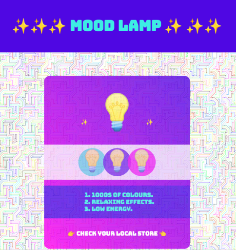
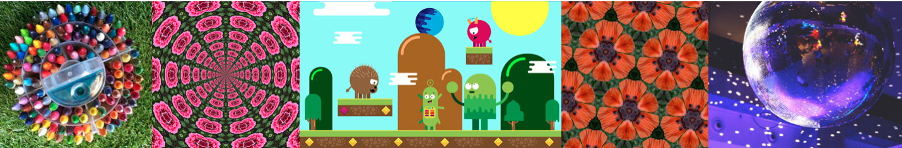

## Ajouter plus de style

Une page de destination doit être vraiment attrayante. Au cours de cette étape, tu peux ajouter un style supplémentaire pour donner à ton produit ou idée une apparence vraiment superbe. 

{:width="300px"}

--- task ---

Tu peux ajouter une **image d'arrière-plan** à ta page web. Cela fonctionne bien avec la transparence sur ton contenu principal.

[[[rpfeditor-image-library]]]

[[[web-background-image]]]

[[[add-transparency]]]

--- /task ---

--- task ---

Tu peux ajouter un **dégradé** à un élément `<main>`, un `<section>`, un `
`, ou un élément ``.

[[[add-a-gradient]]]

**Astuce :** essaie de changer la direction du dégradé pour décider de ce que tu préfères.

--- /task ---

**Astuce :** toutes les modifications que tu apportes aux classes dans `style.css` s'appliquent partout sur la page web où la classe est utilisée. Tu souhaiteras peut-être introduire une nouvelle classe CSS. Tu voudras peut-être un troisième style de dégradé, des combinaisons de couleurs différentes ou des bordures différentes.

--- task ---

Tu peux créer une nouvelle classe si tu veux plus de variété sur ta page web.

[[[web-add-class]]]

--- /task ---

--- task ---

Tu peux styliser des éléments avec des bordures, des ombres ou des coins arrondis.

[[[web-borders]]]

[[[rounded-corners]]]

[[[web-box-shadow]]]

--- /task ---

--- task ---

Tu peux également modifier la taille des éléments à l'aide des titres ou du style du texte.

[[[web-strong-em]]]

[[[web-large-text-tiles]]]

**Astuce :** tu peux changer la taille d'un emoji comme tu changerais la taille de ton texte. Utilise les balises de titre ou les classes `bigfont` et `hugefont`.

[[[huge-emoji]]]

--- /task ---

--- task ---

**Test :** regarde ta page de destination. Y a-t-il autre chose que tu pourrais faire pour inciter les gens à prêter attention à ton produit ou à ton idée ?

[[[image-not-displayed]]]

[[[font-not-displayed]]]

[[[web-debug-link]]]

--- /task ---
