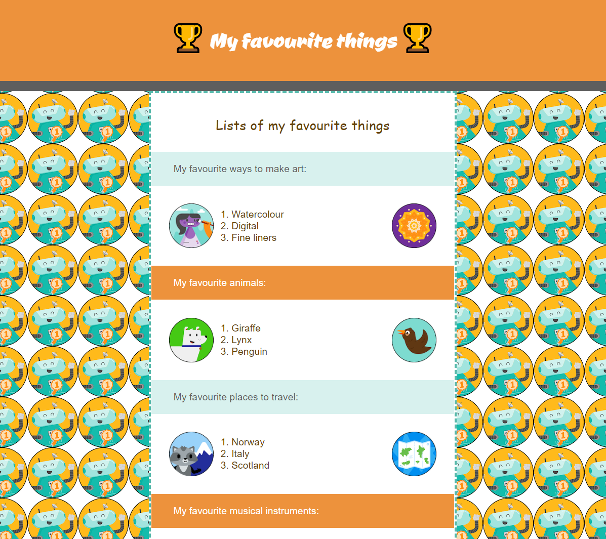

## Et ensuite ?

Si tu suis le parcours [Intro au web](https://projects.raspberrypi.org/fr/pathways/web-intro), tu peux passer au projet [Concevoir une page web](https://projects.raspberrypi.org/fr-FR/projects/build-a-webpage). Dans ce projet, tu réaliseras une page web pour promouvoir un produit ou une idée.

\--- print-only ---

\--- /print-only ---

\--- no-print ---

**Choses préférées** : 

<iframe src="https://editor.raspberrypi.org/en/embed/viewer/favourite-things" width="600" height="500" frameborder="0" marginwidth="0" marginheight="0" allowfullscreen> </iframe>

\--- /no-print ---
