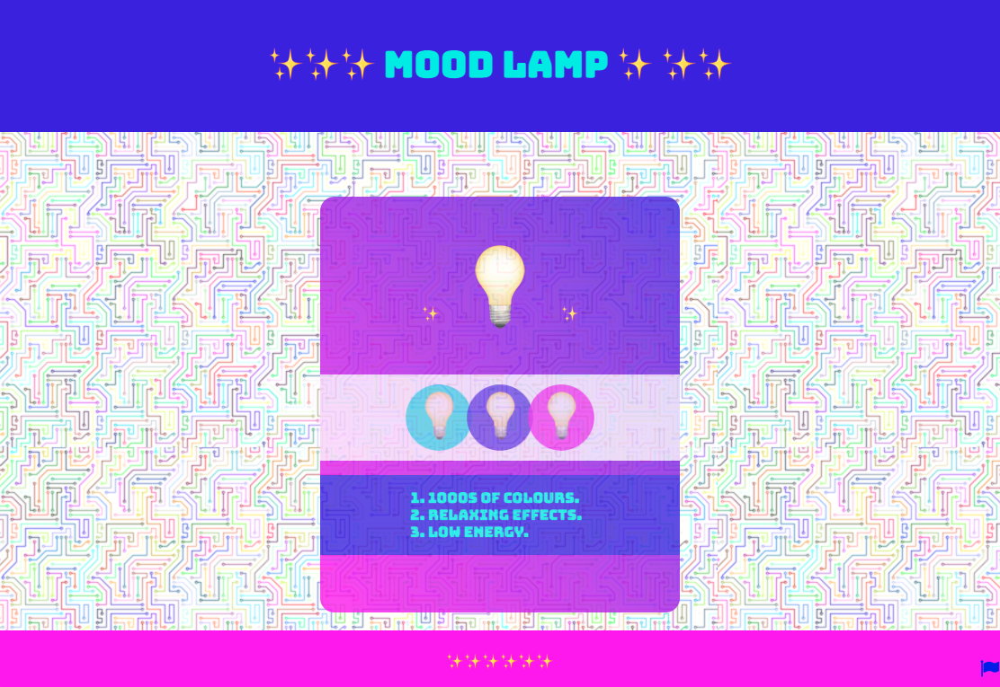

## Inleiding

In dit project maak je een webpagina om een product of idee te verkopen op basis van de door jou gekozen emoji's. Zo'n soort webpagina wordt een **landingspagina** genoemd.

Een **landingspagina** is een enkele webpagina die is ontworpen om mensen te overtuigen van een product of idee. Het doel van een landingspagina is om iemand te vragen actie te ondernemen. Dit zou kunnen zijn om iets te kopen, meer te recyclen, deel te nemen aan een evenement of de webpagina met anderen te delen. 

Je gaat:

- Korte zinnetjes en een eenvoudige lay-out gebruiken om jouuw product of idee aan de bezoekers te tonen
- Je bezoekers erbij betrekken met interactie of animatie
- Jouw pagina stijlen zo dat deze de aandacht van bezoekers trekt

Een persoon die een webpagina of website bekijkt, wordt vaak een **bezoeker** genoemd. 

\--- no-print ---

\--- task ---

### Probeer het uit

Skateboarden is een leuke sport om uit te proberen en er zijn verschillende vaardigheden die mensen kunnen leren. Welke effecten zijn er gebruikt om ervoor te zorgen dat deze webpagina mensen enthousiast maakt voor de sport?
**Skateboarden**: [Bekijk van binnen](https://editor.raspberrypi.org/en/projects/skateboarding){:target="_blank"}

<iframe src="https://editor.raspberrypi.org/en/embed/viewer/skateboarding" width="600" height="500" frameborder="0" marginwidth="0" marginheight="0" allowfullscreen> </iframe>

\--- /task ---

### Doe inspiratie op

Je gaat een aantal ontwerpbeslissingen nemen om je landingspagina te maken.

\--- task ---

Bekijk deze voorbeeldprojecten om meer ideeën op te doen.

**Bananenbrood**: [Bekijk van binnen](https://editor.raspberrypi.org/en/projects/vegan-banana-bread){:target="_blank"}

<iframe src="https://editor.raspberrypi.org/en/embed/viewer/vegan-banana-bread" width="600" height="500" frameborder="0" marginwidth="0" marginheight="0" allowfullscreen> </iframe>

**Stemmingslamp**: [Bekijk van binnen](https://editor.raspberrypi.org/en/projects/mood-lamp){:target="_blank"}

<iframe src="https://editor.raspberrypi.org/en/embed/viewer/mood-lamp" width="600" height="500" frameborder="0" marginwidth="0" marginheight="0" allowfullscreen> </iframe>

**Nachtelijke hemel**: [Bekijk van binnen](https://editor.raspberrypi.org/en/projects/night-sky){:target="_blank"}

<iframe src="https://editor.raspberrypi.org/en/embed/viewer/night-sky" width="600" height="500" frameborder="0" marginwidth="0" marginheight="0" allowfullscreen> </iframe>

**Coolest Projects**: [Bekijk van binnen](https://editor.raspberrypi.org/en/projects/coolest-projects){:target="_blank"}

<iframe src="https://editor.raspberrypi.org/en/embed/viewer/coolest-projects" width="600" height="500" frameborder="0" marginwidth="0" marginheight="0" allowfullscreen> </iframe>

**Circus**: [Bekijk van binnen](https://editor.raspberrypi.org/en/projects/sell-me-something-circus-example){:target="_blank"}

<iframe src="https://editor.raspberrypi.org/en/embed/viewer/sell-me-something-circus-example" width="600" height="500" frameborder="0" marginwidth="0" marginheight="0" allowfullscreen> </iframe>

\--- /task ---

\--- /no-print ---

\--- print-only ---

### Doe inspiratie op

**Skateboarden**

**Bananenbrood**

**Stemmingslamp**

**Nachtelijke hemel**

**Coolest Projects**

**Circus**

TODO 

\--- /print-only ---
