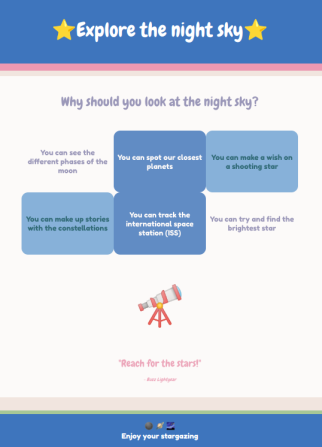

## Voeg je inhoud toe

In deze stap voeg je inhoud toe die helpt jouw product of idee te verkopen. Dit kan een lijst met belangrijke punten, functielijsten of klantcitaten zijn. 

{:width="300px"}

Webpagina **ontwerp** is een proces om een pagina visueel aantrekkelijk te maken, de juiste inhoud te kiezen en te ontwerpen voor toegankelijkheid en gebruikerservaring. Een deel van het webpagina-ontwerpproces is het kiezen van het juiste HTML-element en het kiezen en creëren van CSS-stijlen.  

\--- task ---

**Kies** een lay-out voor jouw webpagina met `<section>` en inhoudstypen om jouw productidee echt aan bezoekers van jouw webpagina te verkopen.

Onthoud dat je een `
` kunt gebruiken om een emoji te bevatten in plaats van een ``.

[[[full-width-section]]]

[[[wrapped-regular-width]]]

[[[wrapped-wide-narrow]]]

[[[side-by-side-section]]]

[[[web-large-text-tiles]]]

[[[web-ordered-list]]]

[[[web-unordered-list]]]

[[[full-width-quote]]]

[[[web-wrap-gap]]]

\--- /task ---

\--- task ---

**Test:** Bekijk jouw webpagina. Zou een bezoeker van jouw webpagina alle informatie hebben die hij of zij nodig heeft om jouw product of idee te begrijpen? Is jouw inhoud overtuigend?

**Mijn webpagina wordt niet correct weergegeven**

[[[incorrect-tags]]]

[[[mismatched-tags]]]

\--- /task ---
