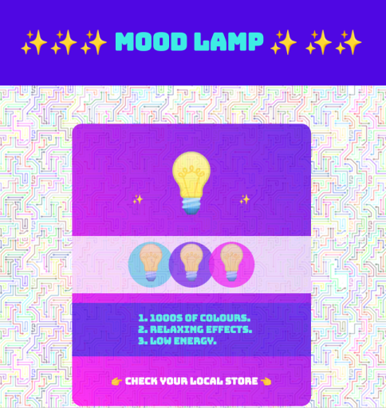
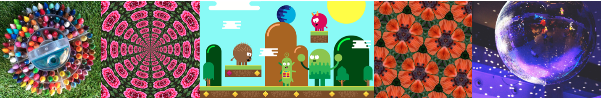
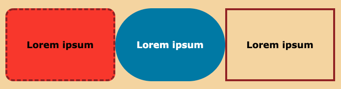
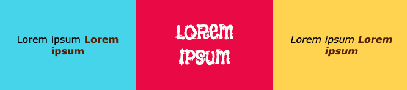

## Voeg meer stijl toe

Een landingspagina moet er echt aantrekkelijk uitzien. In deze stap kun je extra stijlen toevoegen om jouw product of idee er echt geweldig uit te laten zien. 

{:width="300px"}

\--- task ---

Je kunt een **achtergrondafbeelding** aan jouw webpagina toevoegen. Dit werkt goed met transparantie voor je hoofdinhoud.

[[[rpfeditor-image-library]]]

[[[web-background-image]]]

[[[add-transparency]]]

\--- /task ---

\--- task ---

Je kunt een **verloop** toevoegen aan een `<main>`, een `<section>`, een `
`, of een `` element.

[[[add-a-gradient]]]

**Tip:** Probeer de richting van het verloop te veranderen om te beslissen wat je voorkeur heeft.

\--- /task ---

**Tip:** Alle wijzigingen die je aanbrengt in klassen in `style.css` zijn overal van toepassing op de webpagina waar de klasse wordt gebruikt. Het kan zijn dat je een nieuwe CSS-klasse wilt introduceren. Misschien wil je een derde verloopstijl, andere kleurencombinaties of andere randen.

\--- task ---

Als je meer variatie op jouw webpagina wilt, kun je een nieuwe klasse maken.

[[[web-add-class]]]

\--- /task ---

\--- task ---

Je kunt elementen stijlen met randen, schaduwen of afgeronde hoeken.

[[[web-borders]]]

[[[rounded-corners]]]

[[[web-box-shadow]]]

\--- /task ---

\--- task ---

Je kunt ook de grootte van elementen wijzigen met behulp van koppen of de tekststijl.

[[[web-strong-em]]]

[[[web-large-text-tiles]]]

**Tip:** Je kunt de grootte van een emoji wijzigen, net zoals je de grootte van je tekst zou wijzigen. Gebruik heading-tags of de klassen `bigfont` en `hugefont`.

[[[huge-emoji]]]

\--- /task ---

\--- task ---

**Test:** Bekijk je landingspagina. Is er nog iets dat je kunt doen om ervoor te zorgen dat mensen aandacht besteden aan jouw product of idee?

[[[image-not-displayed]]]

[[[font-not-displayed]]]

[[[web-debug-link]]]

\--- /task ---
