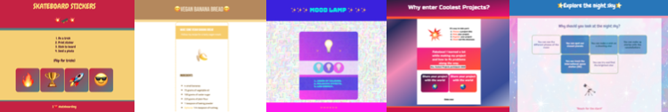
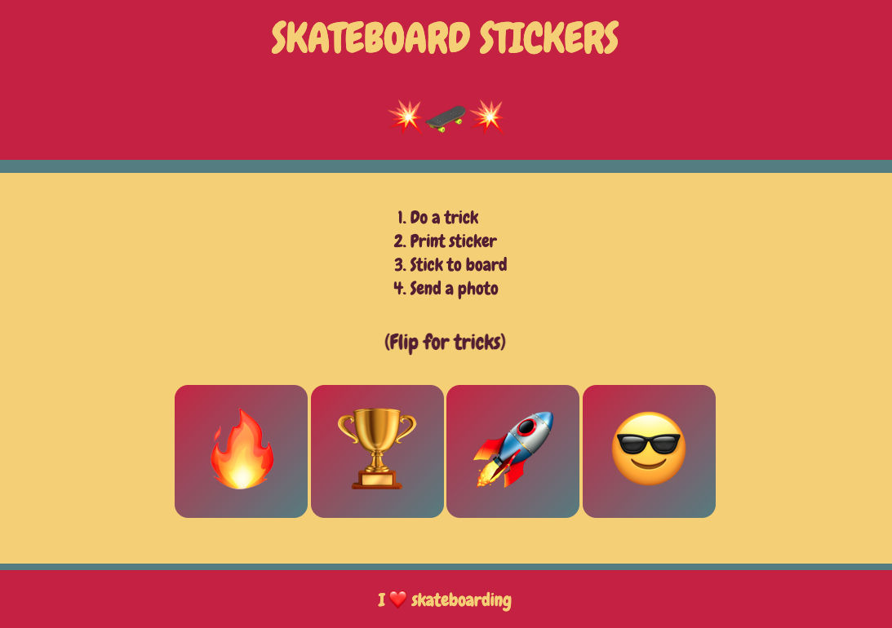
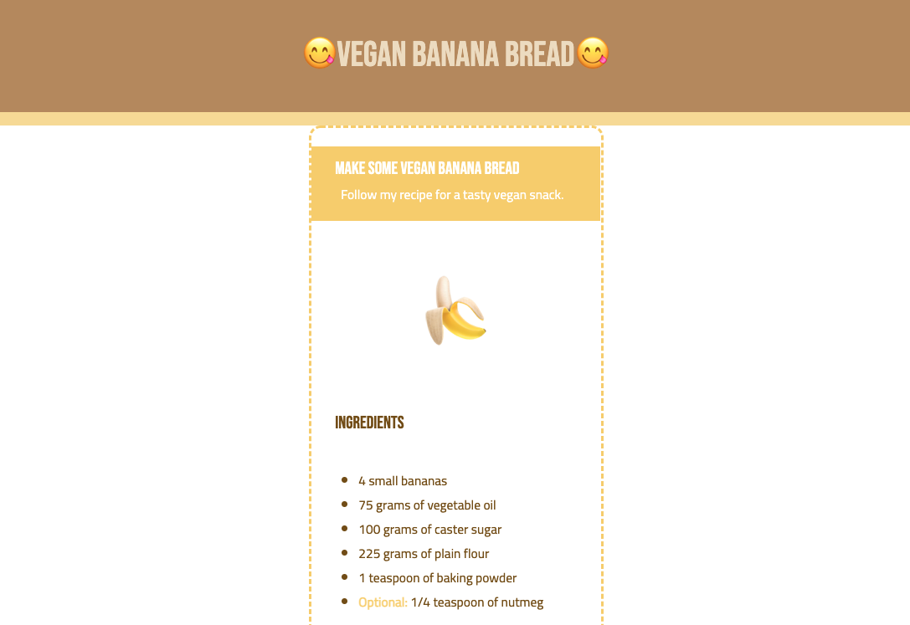
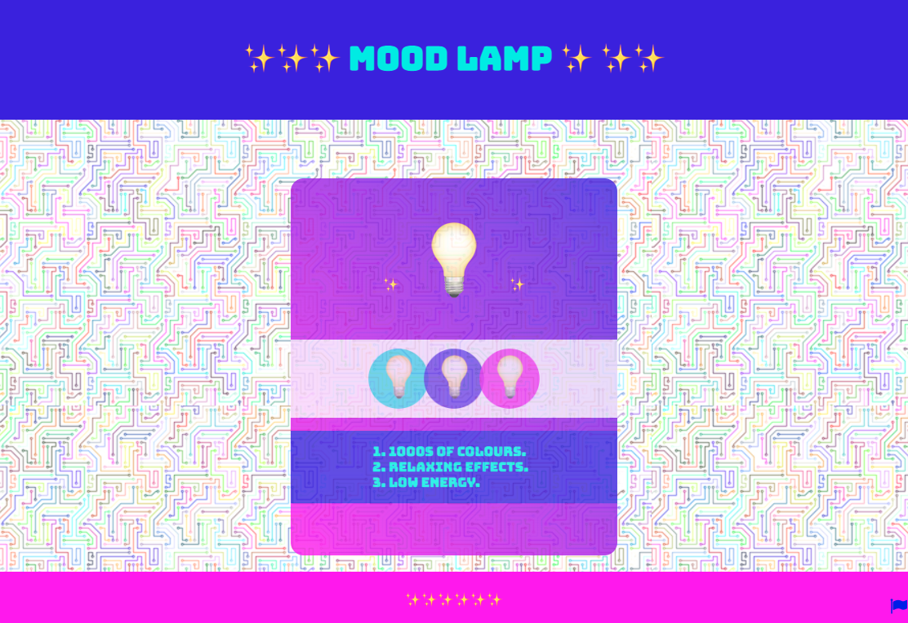
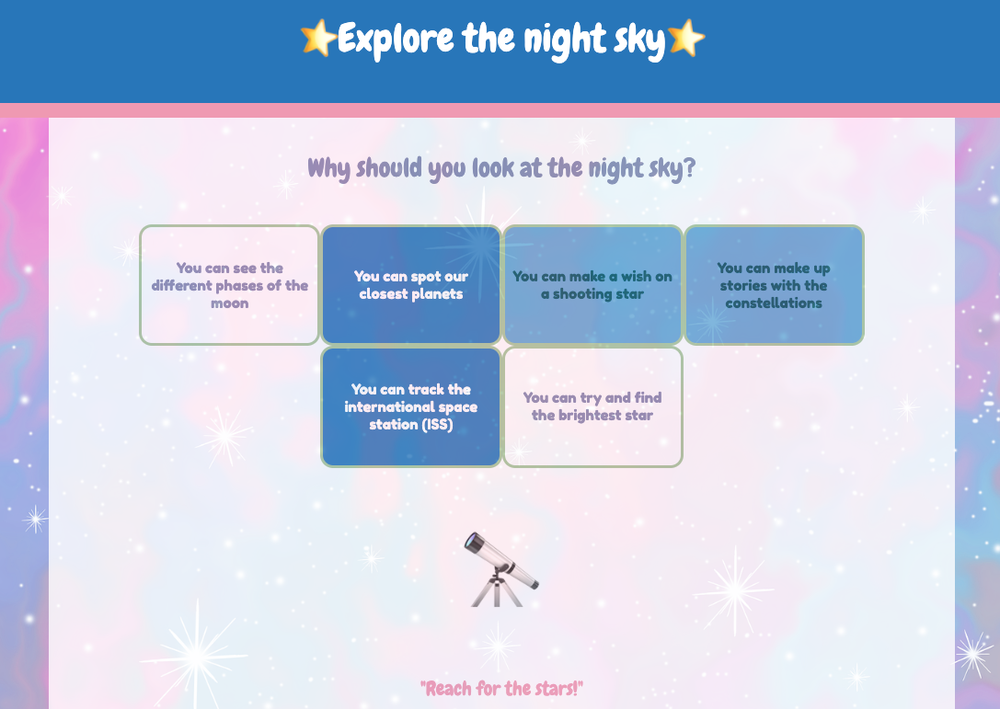
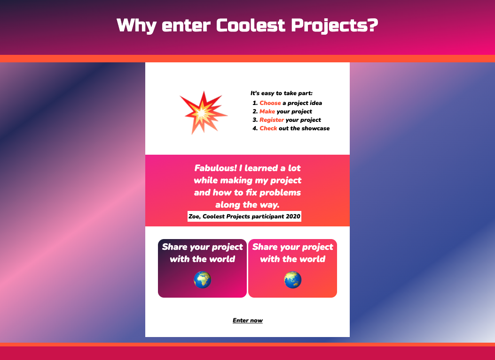

## Вступ

У цьому проєкті ти створиш вебсторінку, де можна продати продукт чи ідею, використавши улюблені емоджі. Така вебсторінка називається **цільовою сторінкою**.

**Цільова сторінка** — це окрема вебсторінка, яка має зацікавити людей продуктом чи ідеєю. Мета цільової сторінки — це спонукати когось до дії. Наприклад, придбати щось, переробляти відходи, взяти участь у заході чи поділитися вебсторінкою з друзями. 

У цьому проєкті ти:

- Навчишся, як розповісти про свій продукт чи ідею відвідувачам вебсторінки за допомогою коротких речень та простої структури
- Зацікавиш людей інтерактивними елементами та анімацією
- Зробиш дизайн сторінки, який приваблюватиме відвідувачів

Особу, яка переглядає вебсторінку або вебсайт, часто називають **відвідувачем**. 

\--- no-print ---

\--- task ---

### Спробуй

Скейтбординг — це цікавий вид спорту, який варто спробувати. Та для цього треба володіти різними навичками. Які ефекти тут використали, щоб вебсторінка викликала у людей інтерес до цього виду спорту?
**Скейтбординг**: [Переглянути код](https://editor.raspberrypi.org/en/projects/skateboarding){:target="_blank"}

<iframe src="https://editor.raspberrypi.org/en/embed/viewer/skateboarding" width="600" height="500" frameborder="0" marginwidth="0" marginheight="0" allowfullscreen> </iframe>

\--- /task ---

### Трішки натхнення

Щоб створити цільову сторінку, ти прийматимеш дизайнерські рішення.

\--- task ---

Переглянь приклади проєктів, щоб отримати більше ідей.

**Банановий хлібчик**: [Переглянути код](https://editor.raspberrypi.org/en/projects/vegan-banana-bread){:target="_blank"}

<iframe src="https://editor.raspberrypi.org/en/embed/viewer/vegan-banana-bread" width="600" height="500" frameborder="0" marginwidth="0" marginheight="0" allowfullscreen> </iframe>

**Лампа настрою**: [Переглянути код](https://editor.raspberrypi.org/en/projects/mood-lamp){:target="_blank"}

<iframe src="https://editor.raspberrypi.org/en/embed/viewer/mood-lamp" width="600" height="500" frameborder="0" marginwidth="0" marginheight="0" allowfullscreen> </iframe>

**Нічне небо**: [Переглянути код](https://editor.raspberrypi.org/en/projects/night-sky){:target="_blank"}

<iframe src="https://editor.raspberrypi.org/en/embed/viewer/night-sky" width="600" height="500" frameborder="0" marginwidth="0" marginheight="0" allowfullscreen> </iframe>

**Coolest projects**: [Переглянути код](https://editor.raspberrypi.org/en/projects/coolest-projects){:target="_blank"}

<iframe src="https://editor.raspberrypi.org/en/embed/viewer/coolest-projects" width="600" height="500" frameborder="0" marginwidth="0" marginheight="0" allowfullscreen> </iframe>

**Гайда в цирк**: [Переглянути код](https://editor.raspberrypi.org/en/projects/sell-me-something-circus-example){:target="_blank"}

<iframe src="https://editor.raspberrypi.org/en/embed/viewer/sell-me-something-circus-example" width="600" height="500" frameborder="0" marginwidth="0" marginheight="0" allowfullscreen> </iframe>

\--- /task ---

\--- /no-print ---

\--- print-only ---

### Трішки натхнення

**Скейтбординг**

**Банановий хлібчик**

**Лампа настрою**

**Нічне небо**

**Coolest Projects**

**Гайда в цирк**

TODO 

\--- /print-only ---

