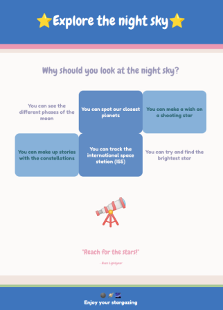
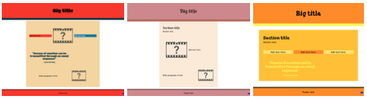
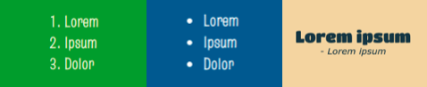

## Наповни свою сторінку

На цьому етапі ти наповниш сторінку вмістом, який допоможе продати твій продукт чи ідею. Це може бути список ключових моментів, пункти з характеристиками або відгуки клієнтів. 

{:width="300px"}

<0>**Дизайн**</0> вебсторінки – це процес, що включає створення візуально привабливої сторінки, вибір відповідного наповнення і забезпечення доступності та зручності в користуванні. Частково процес дизайну вебсторінки також полягає в тому, щоб обрати відповідний HTML-елемент та створити стилі CSS.  

--- task ---

**Вибери** макет для своєї вебсторінки з `<section>` і типом вмісту щоб точно продати свою ідею товару відвідувачам твоєї вебсторінки.

Не забувай, що можна використати `
`, щоб вставити емоджі, замість ``.

[[[full-width-section]]]

[[[wrapped-regular-width]]]

[[[wrapped-wide-narrow]]]

[[[side-by-side-section]]]

[[[web-large-text-tiles]]]

[[[web-ordered-list]]]

[[[web-unordered-list]]]

[[[full-width-quote]]]

[[[web-wrap-gap]]]

--- /task ---

--- task ---

**Протестуй**, як виглядає твоя вебсторінка. Чи матиме відвідувач твоєї вебсторінки всю потрібну інформацію, щоб зрозуміти твій продукт чи ідею? Чи є твій контент переконливим?

**Моя вебсторінка відображається неправильно**

[[[incorrect-tags]]]

[[[mismatched-tags]]]

--- /task ---
