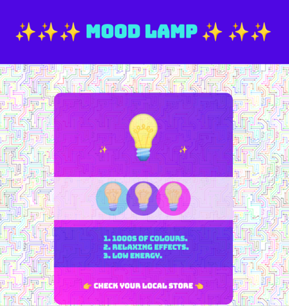
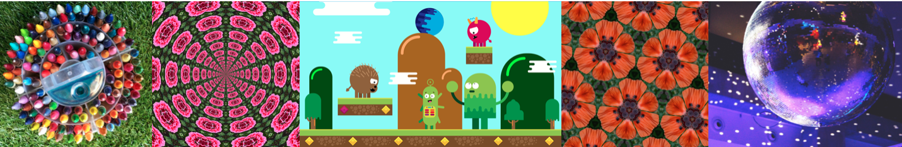
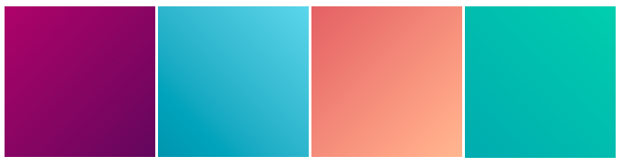
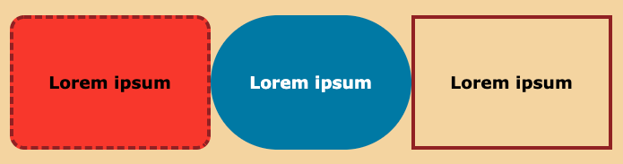
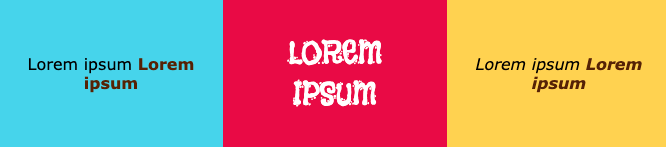

## Додай стилю

Цільова сторінка має виглядати дуже привабливо. На цьому етапі ти додаси більше стилю, щоб твій продукт чи ідея виглядали справді чудово. 

{:width="300px"}

--- task ---

Можеш додати **фонове зображення** на свою вебсторінку. Особливо гарно буде, якщо основний вміст твого контенту прозорий.

[[[rpfeditor-image-library]]]

[[[web-background-image]]]

[[[add-transparency]]]

--- /task ---

--- task ---

Можеш додати **градієнт** до елемента `<main>`, `<section>`, `
` або ``.

[[[add-a-gradient]]]

**Підказка:** спробуй змінити напрямок градієнта, і виріши, що тобі більш до вподоби.

--- /task ---

**Підказка:** будь-які зміни, які ти робиш з класами в `style.css` застосовуються всюди на вебсторінці, де використовується цей клас. Можливо, ти захочеш ввести новий клас CSS. Або ж тобі закортить створити третій стиль градієнта, інші комбінації кольорів або різні межі.

--- task ---

Ти можеш створити новий клас, якщо хочеш більшої різноманітності на вебсторінці.

[[[web-add-class]]]

--- /task ---

--- task ---

Також можна стилізувати елементи за допомогою меж, тіней або заокруглених кутів.

[[[web-borders]]]

[[[rounded-corners]]]

[[[web-box-shadow]]]

--- /task ---

--- task ---

А ще можеш змінити розмір елементів за допомогою заголовків або стилю тексту.

[[[web-strong-em]]]

[[[web-large-text-tiles]]]

**Підказка:** можеш змінити розмір емоджі так само, як розмір тексту. Використовуй теги заголовків або класи `bigfont` («великий шрифт») та `hugefont` («величезний шрифт»).

[[[huge-emoji]]]

--- /task ---

--- task ---

**Протестуй**, як виглядає твоя цільова сторінка. Що ще можна зробити, щоб люди звернули увагу на твій продукт чи ідею?

[[[image-not-displayed]]]

[[[font-not-displayed]]]

[[[web-debug-link]]]

--- /task ---
