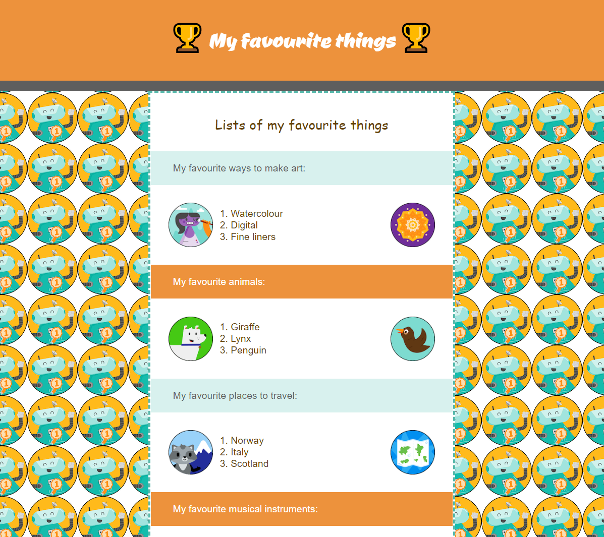

## Що далі?

Якщо ти йдеш напрямом [Вступ до веброзробки](https://projects.raspberrypi.org/en/raspberrypi/web-intro), можеш переходити до наступного проєкту — [Створи вебсайт](https://projects.raspberrypi.org/en/projects/build-a-webpage). У цьому проєкті ти створиш вебсторінку для просування продукту або ідеї.

\--- print-only ---

\--- /print-only ---

\--- no-print ---

**Улюблене**: 

<iframe src="https://editor.raspberrypi.org/en/embed/viewer/favourite-things" width="600" height="500" frameborder="0" marginwidth="0" marginheight="0" allowfullscreen> </iframe>

\--- /no-print ---
